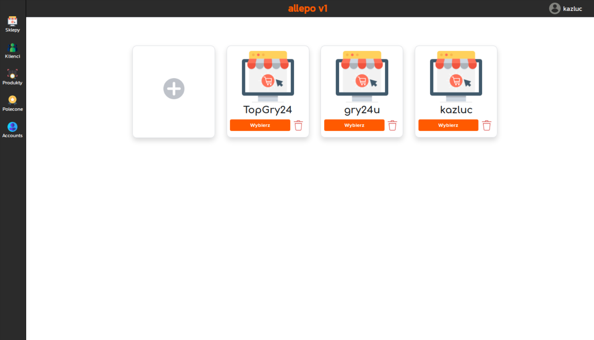

# ALLEPO V1

#### ALLEPO V1 is a software for automating the sale of digital products on allegro.pl and allegrolokalnie.pl
## Products set
### ALLEPO V1 has four main products
   * ALLEPO Control Panel
   * ALLEGRO REST API BASED BOT [ ALLEGRO_PY ]
   * ALLEGRO LOKALNIE SELENIUM BASED BOT [Alocal]
   * MICROSOFT LIVE SELENIUM BASED BOT [ MICROSOFT_BOT ]

## ALLEPO Control panel

This is the  web application which is used to manage 
    products, customers, users, and other features.
    Communications between Control panel and bots
    are based on rest api requests and mysql database.

## ALLEPO_PY

 ALLEGRO_PY is an sales automation bot for digital products ,
    basically it handles new orders, extracting crucial data for his tasks
    and it realizing customers order without human interaction.
    ALLEGRO_PY is an solution for selling situations when
    seller has thousands of digital products which USERNAME:PASSWORD credentials,
    and after every order credentials must be sent to the buyer's mail to activate bought product.

## Alocal

    ALOCAL has the same functions as ALLEGRO_PY but it doesnt interacting with AllegroLokalnie.pl
    servers using rest api because AllegroLokalnie doesn't provides any kind of REST API,
    and to solve this issue, i implemented selenium based web scraper which providing all
    necessary data to handle orders.

## MICROSOFT_BOT

    MICROSOFT_BOT is an chromium based bot which allow customers to activated
    bought xbox live accounts.

