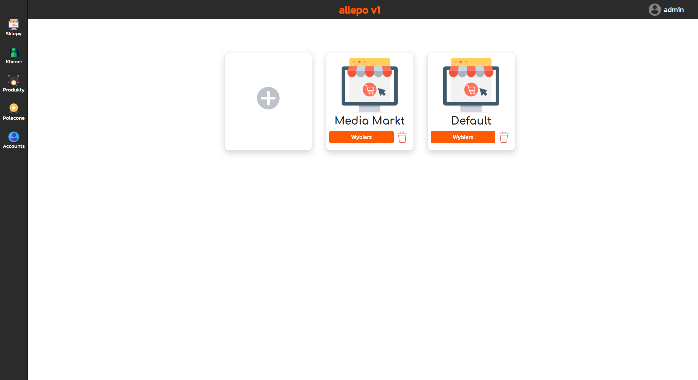

# ALLEPO V2

#### ALLEPO V2 to is a software for automating the sale of digital products on allegro.pl and allegrolokalnie.pl
## Products set
### ALLEPO V2 has four main products
   * ALLEPO Control Panel
   * ALLEGRO REST API BASED BOT [ ALLEGRO_PY ]
   * ALLEGRO LOKALNIE SELENIUM BASED BOT [Alocal]
   * MICROSOFT LIVE SELENIUM BASED BOT [ MICROSOFT_BOT ]

## ALLEPO Control panel

This is the  web application which is used to manage 
    products, customers, users, and other features.
    Communications between Control panel and bots
    are based on rest api requests and mysql database.

